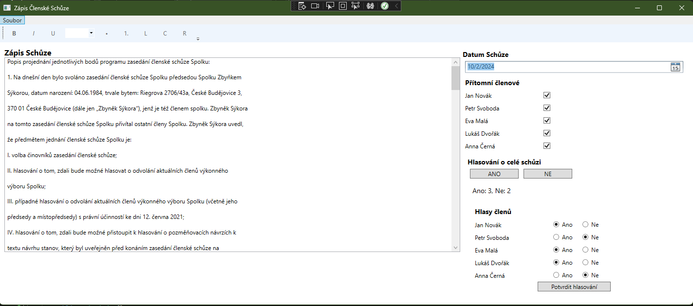
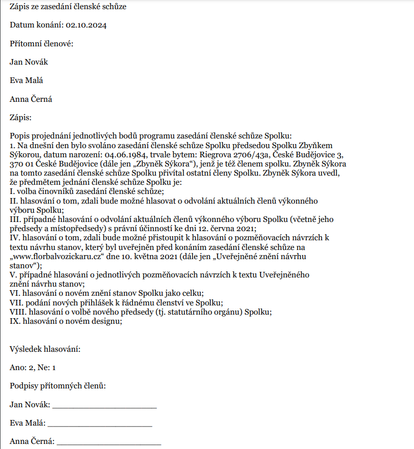

# Zápis ze Zasedání Členské Schůze

Tato aplikace slouží k zaznamenávání členských schůzí a spravování zápisů s možností hlasování. Aplikace umožňuje zaznamenávat detaily schůze, včetně přítomnosti členů představenstva, projednávaných bodů, hlasování a výsledků hlasování. Následně lze vytisknout formátovaný zápis včetně podpisů členů.

## Funkce

- **Přidání zápisu schůze**: Zápis z jednání lze vložit do RichTextBoxu s podporou formátování.
- **Hlasování členů**: Umožňuje zaznamenat, jak jednotliví členové hlasovali (ano/ne).
- **Zobrazení výsledků hlasování**: Po hlasování se zobrazí souhrn hlasů včetně jmen a rozhodnutí jednotlivých členů.
- **Možnost tisku**: Lze vygenerovat a vytisknout formátovaný zápis včetně podpisů přítomných členů.
- **Ukládání a načítání**: Schůze lze ukládat pro pozdější revizi a načítat uložené záznamy.
- **Minimalizace aplikace**: Aplikace obsahuje možnost minimalizace a plného zobrazení na obrazovce.
 
## Technické Detaily

- **Jazyk**: C#
- **Platforma**: .NET Framework (WPF)
- **Textové pole**: RichTextBox s podporou formátování a skrolování dlouhých textů.
- **Tisk**: Možnost generovat tištěné výstupy pomocí FlowDocument.

## Instalace

1. Stáhněte nebo naklonujte tento repozitář:
   ```bash
   git clone https://github.com/DippyM/SchuzeApp
   Otevřete projekt ve Visual Studiu.
   Sestavte a spusťte aplikaci (F5).
   Použití
   Otevřete aplikaci a zadejte datum a podrobnosti schůze.
   Zaškrtněte členy, kteří jsou přítomni na schůzi.
   Zadejte podrobnosti projednávaných bodů a klikněte na tlačítko pro hlasování.
   Po hlasování se zobrazí výsledky, které lze vytisknout nebo uložit.
   Pro pozdější použití můžete schůzi uložit a načíst.
   Budoucí Funkce
   Umožnění přidání komentářů a příloh k jednotlivým bodům schůze.
   Rozšíření exportu o další formáty, jako PDF.